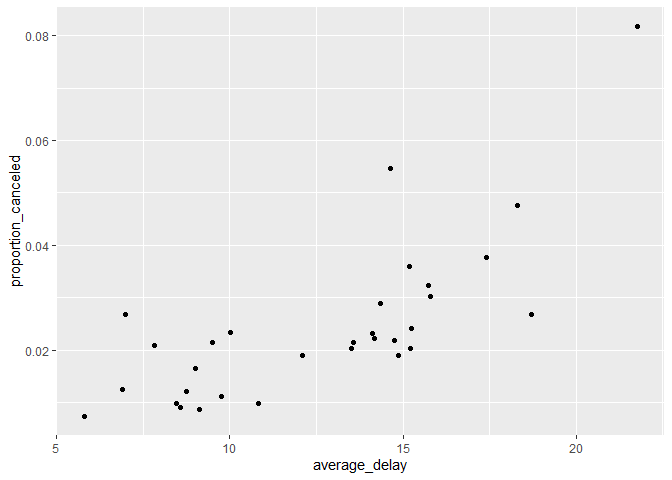

HW1
================
Andrew Li
2022-09-24

<https://github.com/P3BBL35/STAT433-HW1>

1.  How many flights have a missing dep_time? What other variables are
    missing? What might these rows represent?

``` r
flights %>%
  filter(is.na(dep_time))
```

``` r
flights %>%
  filter(is.na(dep_time)) %>%
  summarise(dep_time, dep_delay, arr_time, arr_delay, air_time)
```

    ## # A tibble: 8,255 × 5
    ##    dep_time dep_delay arr_time arr_delay air_time
    ##       <int>     <dbl>    <int>     <dbl>    <dbl>
    ##  1       NA        NA       NA        NA       NA
    ##  2       NA        NA       NA        NA       NA
    ##  3       NA        NA       NA        NA       NA
    ##  4       NA        NA       NA        NA       NA
    ##  5       NA        NA       NA        NA       NA
    ##  6       NA        NA       NA        NA       NA
    ##  7       NA        NA       NA        NA       NA
    ##  8       NA        NA       NA        NA       NA
    ##  9       NA        NA       NA        NA       NA
    ## 10       NA        NA       NA        NA       NA
    ## # … with 8,245 more rows

Here we can see that 8,255 flights are missing a `dep_time` value. Other
missing variables include `dep_delay`, `arr_time`, `arr_delay`, and
`air_time`. These rows may represent any flights that were canceled.

2.  Currently `dep_time` and `sched_dep_time` are convenient to look at,
    but hard to compute with because they’re not really continuous
    numbers. Convert them to a more convenient representation of number
    of minutes since midnight.

``` r
flights %>%
  mutate(dep_time = ((dep_time %/% 100) * 60) + dep_time %% 100,
         sched_dep_time = ((sched_dep_time %/% 100) * 60) + sched_dep_time %% 100)
```

    ## # A tibble: 336,776 × 19
    ##     year month   day dep_time sched_de…¹ dep_d…² arr_t…³ sched…⁴ arr_d…⁵ carrier
    ##    <int> <int> <int>    <dbl>      <dbl>   <dbl>   <int>   <int>   <dbl> <chr>  
    ##  1  2013     1     1      317        315       2     830     819      11 UA     
    ##  2  2013     1     1      333        329       4     850     830      20 UA     
    ##  3  2013     1     1      342        340       2     923     850      33 AA     
    ##  4  2013     1     1      344        345      -1    1004    1022     -18 B6     
    ##  5  2013     1     1      354        360      -6     812     837     -25 DL     
    ##  6  2013     1     1      354        358      -4     740     728      12 UA     
    ##  7  2013     1     1      355        360      -5     913     854      19 B6     
    ##  8  2013     1     1      357        360      -3     709     723     -14 EV     
    ##  9  2013     1     1      357        360      -3     838     846      -8 B6     
    ## 10  2013     1     1      358        360      -2     753     745       8 AA     
    ## # … with 336,766 more rows, 9 more variables: flight <int>, tailnum <chr>,
    ## #   origin <chr>, dest <chr>, air_time <dbl>, distance <dbl>, hour <dbl>,
    ## #   minute <dbl>, time_hour <dttm>, and abbreviated variable names
    ## #   ¹​sched_dep_time, ²​dep_delay, ³​arr_time, ⁴​sched_arr_time, ⁵​arr_delay

3.  Look at the number of canceled flights per day. Is there a pattern?
    Is the proportion of canceled flights related to the average delay?
    Use multiple `dyplr` operations, all on one line, concluding with
    `ggplot(aes(x= ,y=)) + geom_point()`

``` r
flights %>%
  group_by(day) %>%
  summarise(average_delay = mean(dep_delay, na.rm=T),
            total_flights = n(),
            canceled_flights = sum(is.na(dep_delay)),
            proportion_canceled = canceled_flights / total_flights) %>%
  ggplot(aes(x = average_delay, y = proportion_canceled)) + geom_point()
```

<!-- -->

There seems to be a positive correlation between the `average_delay` and
`proportion_cancelled`. That is, the larger the departure delay, the
more likely it is that the flight is cancelled altogether.
